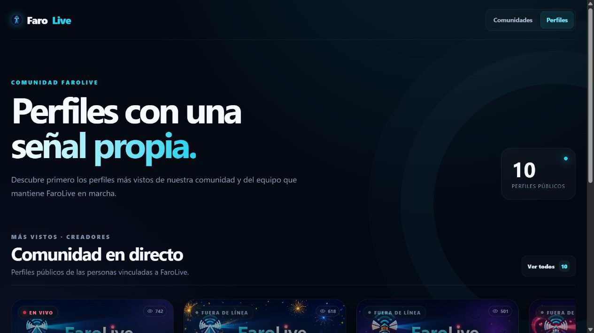
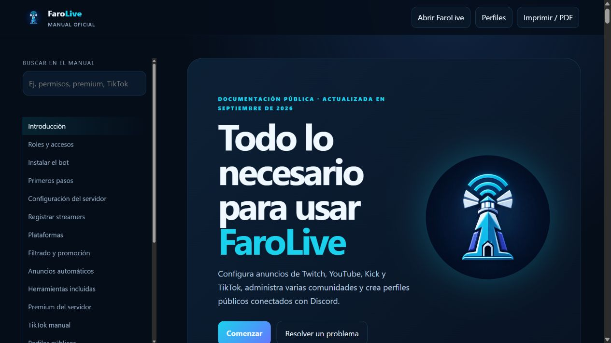

# Manual de FaroLive

Manual público para propietarios, administradores, staff y streamers que utilizan FaroLive. La edición actual documenta el panel rediseñado, las herramientas gratuitas, los anuncios automáticos y los paquetes temporales desbloqueables para perfiles y servidores.

El manual incluye quince capturas obtenidas de una ejecución local aislada con usuarios, servidores, estadísticas y transmisiones completamente ficticios. No se utilizaron credenciales ni datos de producción.

**Sitio del manual:** <https://rafaelsaucedo2302.github.io/FaroLive-Manual/>

## Contenido principal

- Instalación, permisos de Discord y delegación por roles.
- Twitch, YouTube y Kick automáticos; TikTok mediante flujo manual guiado.
- Filtrado por hashtag, anuncios multistream, reconexiones y recuperación.
- Diagnóstico, reintentos, tablero de directos y estadísticas auditables.
- Paquete premium unificado del servidor y beneficios premium del perfil.
- Notificaciones, reclamo de regalos, temporadas Top 10 y panel global.
- Perfiles públicos, identidad estacional, seguridad y solución de problemas.

## Publicación con GitHub Pages

1. Crea un repositorio público vacío llamado `FaroLive-Manual`.
2. Sube el contenido de esta carpeta a la rama `main`.
3. Abre **Settings → Pages**.
4. En **Build and deployment**, elige **Deploy from a branch**.
5. Selecciona la rama `main`, la carpeta `/ (root)` y guarda.

GitHub publicará `index.html`. Este repositorio contiene únicamente documentación y recursos gráficos; no contiene el código de FaroLive, credenciales ni procedimientos internos de producción.
